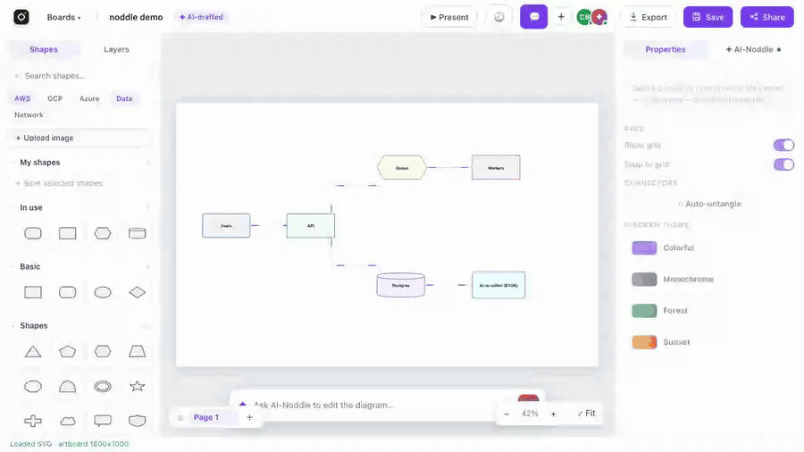
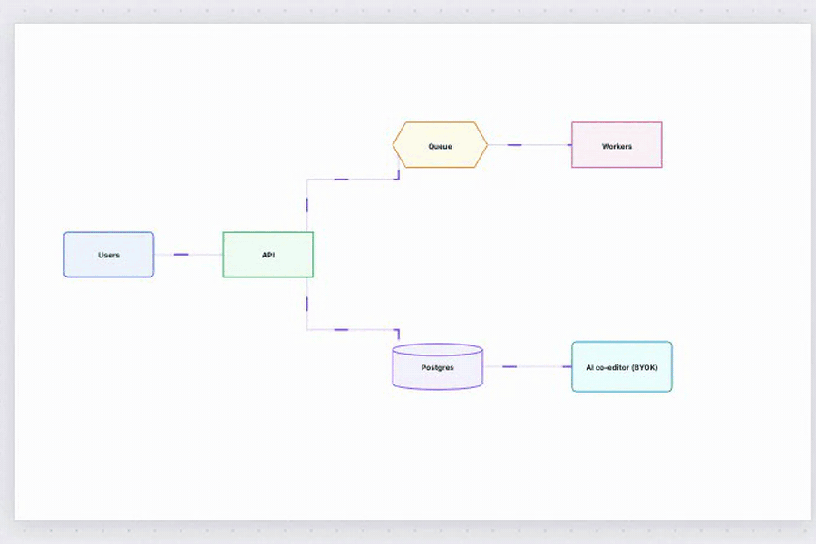
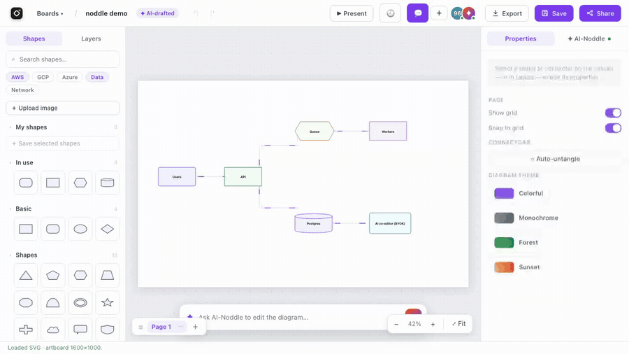

# ◇ noddle draw

**Open-source anonymous diagram board** — structured shapes and smart
connectors like Lucidchart, instant no-login drawing and link-sharing like
Excalidraw, plus an AI co-editor that edits the board with you (bring your
own API key).

> **▶ Try it now: <https://draw.noddle.dev>** — no sign-up, you're drawing
> in one second.

Part of the [**Noddle**](https://github.com/noddle-dev) open-source suite.

## Draw together — the link is the invite

Share the board URL and people are co-editing instantly: shared cursors,
presence, live state sync over WebSocket. No accounts anywhere — your identity
is auto-generated in your browser (rename it in the Share dialog).



## Real diagramming, with living connectors

Flowchart shapes, containers, multi-page boards, stencil libraries, text wrap,
align/distribute, full keyboard shortcuts — and orthogonal auto-routed arrows
(A\* elbow routing with draggable waypoints) that can **animate**: dash, dots,
beam or pulse flows to show data moving through your system.



## AI co-editor — your key, your browser (BYOK)

Chat with the board: *"add an error-handling branch"*, *"group these by
tier"*, image→diagram conversion (whiteboard photo → editable shapes),
text/Mermaid→diagram. Your Anthropic / OpenAI / Gemini / OpenRouter key stays
in **your browser's localStorage** and rides each request as a header — the
server proxies the call and never stores it. A **Test** button proves the key
works before you save it. No key? The AI simply stays off.



## Features

- ⚡ **Zero friction** — open the site, you're drawing. `/` reopens the board
  you were working on; the board URL is the sharing capability.
- 👥 **Live collaboration** — cursors, presence, per-page sync + anonymous
  comment threads pinned to shapes.
- ✦ **AI co-editor (BYOK)** — concurrent-edit safe: while the AI works you can
  keep editing; its changes merge onto your latest board instead of replacing it.
- 📤 **Export** — SVG, PNG, animated GIF, per-page deck PNGs, Mermaid, and a
  re-importable board JSON. Imports draw.io files.
- 🧩 **Agent-friendly** — a small [MCP server](mcp/) lets AI agents create and
  edit boards through the REST API (the board URL is the capability — no
  tokens needed).

## Self-host in one command

```bash
docker compose up --build
# → http://localhost:8000  — start drawing, no sign-up
```

One container (FastAPI + prebuilt React SPA) plus Postgres. Without Docker:

```bash
# backend
python3 -m venv .venv && source .venv/bin/activate
pip install -r backend/requirements.txt
cd backend && uvicorn main:app --reload --port 8000

# frontend (dev server with hot reload, proxies /api → :8000)
cd web && npm install && npm run dev   # → http://localhost:5173
```

No database needed for local hacking — without `DATABASE_URL` everything
persists to `backend/storage/` files.

## Configuration

Everything is optional; the app degrades gracefully when a feature isn't
configured. Copy `.env.example` to `.env` and fill in what you need:

| Variable | Purpose |
|---|---|
| `DATABASE_URL` | Postgres persistence (schema auto-migrates at boot). Absent → file storage. |
| `NODDLE_ALLOWED_ORIGINS` | CORS allowlist for dev tooling (prod is same-origin). |
| `OPENROUTER_POOL_KEY` | Optional **zero-cost free tier**: key-less visitors ride OpenRouter `:free` models on this key (tip: a one-time $10 account top-up unlocks 1,000 free-model requests/day at $0). Guarded by per-IP limits (`POOL_RPM_PER_IP`/`POOL_RPD_PER_IP`), a global `POOL_DAILY_BUDGET`, and optional Cloudflare Turnstile (`TURNSTILE_SECRET` + `TURNSTILE_SITE_KEY`). |
| `DATABRICKS_*` | Optional private server AI pool (takes priority over the free tier). |
| `S3_*` | Optional S3-compatible object storage for log shipping/backups. |

## Architecture (short version)

Single deployable, clean layering:

- `backend/` — FastAPI, hexagonal: `api → services → domain`, with
  `infrastructure/` adapters (Postgres via psycopg, or plain files — chosen at
  boot). WebSocket rooms for live collab. Whitelist SVG sanitizer on every
  stored/generated SVG.
- `web/` — React + TypeScript (Vite). The editor engine (`editor-core/`) is
  pure TypeScript with no React/DOM dependencies; state is Zustand; features
  are vertical slices.
- `mcp/` — stdlib-only MCP server for AI agents.

Run the tests: `python -m pytest backend/tests -q` and `cd web && npm run typecheck`.

## Security notes

Boards are protected by unguessable URLs (capability links) — the same model
as Excalidraw share links: anyone with a board's link can view and co-edit it,
so treat the link as the secret it is. Uploaded and AI-generated SVG is
sanitized server-side (scripts, event handlers and foreign objects stripped).
BYOK AI keys live only in the browser's localStorage and transit per-request
over HTTPS; the server neither stores nor logs them.

### Upgrading from the accounts-era build

Older deployments (with users/teams/billing) keep their extra tables — this
build simply stops using them. To make pre-existing boards reachable under the
anonymous model, run once against your database:

```sql
UPDATE documents SET owner_id = NULL;
UPDATE documents SET link_policy = 'edit' WHERE link_policy = 'private';
```

(Skip the second statement if some boards must stay dark.) Optional cleanup of
dead tables: `DROP TABLE users, sessions, tokens, teams, team_members,
ai_settings, subscriptions, ls_webhook_events, billing_events,
pricing_catalog, folders, document_shares, mentions, user_activity, ai_usage,
games_leaderboard, notifications;`

## Part of the Noddle suite

noddle draw is built and maintained by the [noddle-dev](https://github.com/noddle-dev)
organization. Contributions welcome — see [CONTRIBUTING.md](CONTRIBUTING.md)
(short version: English only, tests green, respect the layering).

## License

[MIT](LICENSE)
